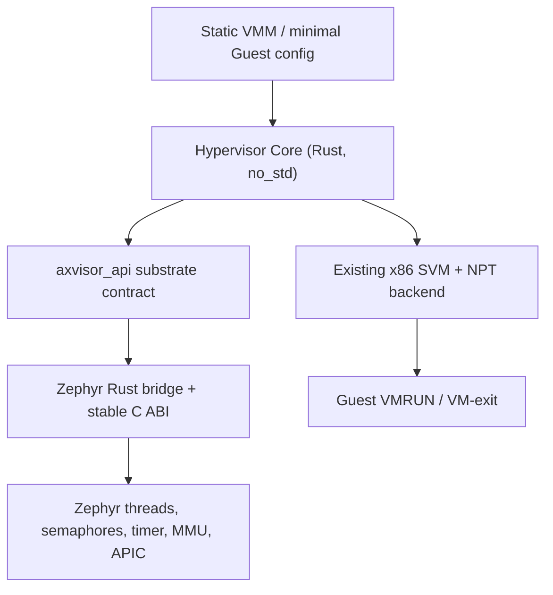

# Zephyr port architecture

## Selected first implementation

The port remains **Zephyr x86_64**. The execution environment is an AMD virtual machine without `/dev/kvm` and exposes neither VMX nor SVM to the outer host. QEMU TCG can, however, model AMD SVM and NPT. Following the project instruction that a hardware limitation need not force x86/VMX, the implementation selects the existing `svm` feature of the same x86_64 Hypervisor Core rather than creating a Zephyr hypervisor or changing the ISA.

This keeps the controlled variables as close as the environment permits:

- same Core revision and `no_std` code;
- same x86_64 target and Guest binary;
- existing Core-owned SVM entry/exit and NPT implementation;
- only the host OS substrate adapter is new;
- VMX and native KVM results remain explicitly blocked, not relabeled as SVM or TCG passes.

## Boundary



Zephyr headers and types occur only below the C ABI. The Core static library is built separately with Cargo for `x86_64-unknown-none`, then linked by the external Zephyr module. No Zephyr kernel source is patched.

## Component layout

| Path | Responsibility |
|---|---|
| `ports/zephyr/rust/src/lib.rs` | Implements the selected `axvisor_api` traits and converts Rust types/closures to stable C handles/callbacks. |
| `ports/zephyr/src/memory.c` | Dedicated physical pool, ownership state, PA↔VA mapping. |
| `ports/zephyr/src/threading.c` | `k_thread` creation, affinity, join, current handle and yield. |
| `ports/zephyr/src/wait.c` | Generation/check-install-recheck semaphore protocol and close/drain. |
| `ports/zephyr/src/time.c` | Monotonic nanoseconds and absolute one-shot timer conversion. |
| `ports/zephyr/src/irq.c` | Contract IRQ registry and dedicated vector-240 APIC IPI. |
| `ports/zephyr/app` | Probe, contract, lifetime, Core, kick and SMP validation modes. |
| `ports/zephyr/guests` | Tiny real-mode Guests and static VM configurations. |
| `scripts/zephyr` | Pinned setup, build, execution, regression, evidence and LOC scripts. |

## Memory design

`memory.c` reserves a statically linked 16 MiB array aligned to 2 MiB. At boot, Zephyr's x86 MMU translation verifies that the first and last pages form one contiguous PA interval. A spinlock-protected byte state per page implements `FREE`, `ALLOCATED`, and `FREEING`.

`FREEING` is important: an allocation is not published as reusable until the prior owner has relinquished it and zeroing is complete. The lifetime suite pauses in this state and proves that an early allocation fails, while a post-release allocation obtains the original PA.

The implementation records the actual range on every boot. In the captured run it is `PA [0x200000, 0x1200000)`, identity-mapped at the same VA by this Zephyr/QEMU configuration. The code does not assume identity mapping: pool translations are calculated as offsets, and contiguity is checked through `arch_page_phys_get`.

## Scheduling and wait semantics

Each Core task is a Zephyr `k_thread`; each vCPU therefore has its own host execution context. Affinity masks are applied before the thread is started. Zephyr remains the scheduler, including the 4-vCPU/2-pCPU oversubscribed run.

The wait queue is not a bare semaphore credit. Each wake increments a generation only after the producer has published its state. A waiter:

1. checks the condition;
2. captures generation and publishes its waiter count under the queue lock;
3. rechecks the condition;
4. checks generation/close once more;
5. only then sleeps on `k_sem`.

This rejects stale wake credits while closing the producer-between-check-and-sleep race.

## IRQ/IPI policy

Vector 240 is installed directly in Zephyr's x86 vector table for the experiment. Startup rejects collision with `CONFIG_SCHED_IPI_VECTOR` (34) and `CONFIG_TLB_IPI_VECTOR` (35). A producer on CPU 1 sends a directed local-APIC IPI to CPU 0. The test brackets a long Guest loop with hypercall markers and requires the ISR log to occur strictly between those markers.

The dedicated IPI is an adapter extension used to validate host notification while a vCPU owns the Guest. It is not added to the 25-operation contract and does not decode or synthesize a VM-exit. On real hardware, a physical interrupt delivered while in SVM causes the architectural exit/interrupt path; TCG's scheduling can service the host interrupt without proving native interrupt-window timing, so the result is labeled software-emulated.

## Build and run flow

```sh
./scripts/zephyr/setup.sh
./scripts/zephyr/build-qemu-tcg.sh
./scripts/zephyr/test-all.sh
./scripts/zephyr/run-hardware.sh   # returns 2 when native execution is blocked
```

`prepare-core.sh` exports the pinned Core commit, applies the three documented host-neutral patches to a generated build tree, and never edits the reference checkout. `build-rust.sh` embeds the selected static TOML configuration and Guest bytes in the Rust static library. `build.sh` links that library into the Zephyr application.

The Rust archive is passed to the compiler driver as one `--whole-archive,<archive>,--no-whole-archive` argument. This prevents Zephyr/CMake link-item reordering from silently dropping the otherwise unreferenced Rust `.percpu` template. After every Core-enabled build, `build.sh` resolves `_percpu_load_start` and `_percpu_load_end` with `nm` and fails if the final ELF contains an empty template; both the TCG and `native` configurations pass this check.

QEMU 8.2.2 TCG required a separate toolchain patch: its old SVM implementation skipped NPT translation for an L2 Guest with paging disabled. `build-qemu-tcg.sh` fetches the pinned QEMU commit, applies `ports/zephyr/qemu/0001-...patch`, and builds a minimal x86_64 TCG binary. This QEMU patch is not a Core, adapter, or Zephyr-kernel change.

## Validation labels

| Label | Meaning |
|---|---|
| `PASS` in baseline/contract/lifetime | Zephyr/QEMU software behavior was executed and checked. |
| `SOFTWARE-EMULATED PASS` | QEMU TCG executed the Core's SVM instructions, Guest instructions and architectural exit decoding; no KVM acceleration was involved. |
| `NATIVE PASS` | Requires `/dev/kvm`, matching host virtualization flags and KVM execution; not achieved in this environment. |
| `BLOCKED` | Required native hardware authority is unavailable; never promoted to PASS. |

The captured host has `host_vmx=no`, `host_svm=no`, and `dev_kvm=no`. Consequently native VMX, native SVM, and native in-Guest IPI timing remain blocked even though the TCG SVM execution path passes.
