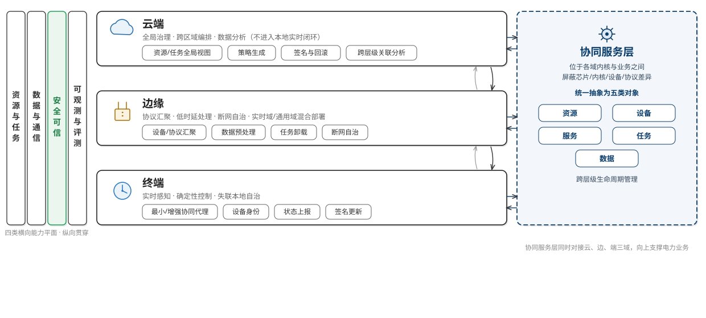

<!-- _class: cover -->
<!-- _footer: "" -->
<!-- _paginate: false -->

# 云边端协同的电力专用 物联操作系统体系架构设计方案

## 中 期 进 展 汇 报

课题1 · “智能电网”国家科技重大专项　·　二〇二六年

<!-- 讲稿备注：本次汇报两部分——中期已完成的体系架构设计方案；研究内容3安全能力增强机制（内核态飞地）的进展与技术路线。 -->

---

# 汇报提纲

<strong>一、体系架构设计方案</strong>  总体体系架构；云边端三域职责；协同服务层与任务放置

<strong>二、研究内容3：安全能力增强机制</strong>  内核态飞地架构；我们的工作与飞地的实现现状

<!-- 讲稿备注：先交代两部分结构和状态标注口径，避免把设计项讲成已完成。 -->

---

<!-- _class: divider -->
<!-- _footer: "" -->

第一部分

# 体系架构设计方案

云—边—端三域，一个协同服务层，四个横向能力平面

<!-- 讲稿备注：进入第一部分，介绍课题中期完成的体系架构方案。 -->

---

# A-1 研究背景与目标

<strong>现状与问题</strong> 电力物联网中设备类型、处理器架构、操作系统、通信协议都很分散，业务实时等级差异大，安全要求高。以往一台设备一套系统、各自为政，跨设备、跨层级、跨地域的协同难以支撑。

<strong>课题目标</strong>
<ul>
<li>形成云—边—端三域加协同服务层的统一体系架构</li>
<li>建立任务、算力、数据、通信的多层级协同机制</li>
<li>建立软硬件结合、覆盖全生命周期的安全可信机制</li>
<li>建立覆盖功能、性能、安全、兼容性、可靠性与协同能力的评测体系</li>
</ul>

其中安全可信是四个横向能力平面之一，也是本课题研究内容3的重点，贯穿启动、运行、恢复各阶段。

<!-- 讲稿备注：说明安全是四个横向平面之一，要求软硬件结合、覆盖全生命周期，引出后面的研究内容3。 -->

---

# A-2 总体体系架构

<!-- 讲稿备注：这一页是总架构图。中间云、边、端三层各有职责与组件；左侧四平面纵向贯穿；右侧协同服务层不是第四层，而是横切三域的中间抽象层，同时对接云、边、端。后面各页从这张图展开。 -->

---

# A-3 三域职责

<strong>终端</strong>
<ul>
<li>固定优先级抢占、优先级继承</li>
<li>关键任务用静态内存池、有界执行路径</li>
<li>Tickless、休眠唤醒、分级采样降功耗</li>
<li>失联时保留本地安全策略与控制</li>
<li>更新须签名验证、失败回滚、版本追踪</li>
</ul>

<strong>边缘</strong>
<ul>
<li>协议汇聚、设备管理、数据预处理</li>
<li>嵌入式 Linux 与 RTOS 混合部署</li>
<li>硬件分区/虚拟化划分 CPU、内存、设备</li>
<li>核间经受控共享内存或消息通道通信</li>
<li>优先保证实时域资源预算</li>
</ul>

<strong>云端</strong>
<ul>
<li>跨边缘节点的资源与任务全局视图</li>
<li>按优先级/区域/可信等级生成策略</li>
<li>面向边缘自治的策略预下发</li>
<li>软件包、模型、配置签名化与回滚</li>
<li>安全、性能、故障事件关联分析</li>
</ul>

<!-- 讲稿备注：把三域各自的具体机制讲清楚，都来自方案的第6、7、8章。 -->

---

# A-4 协同服务层与任务放置

<h3>协同服务层的作用</h3>

位于各域内核与电力业务之间，是整个体系的核心抽象。它把云、边、端上不同操作系统的能力，统一表示为资源、设备、服务、任务、数据五类对象，并提供跨层级的生命周期管理。

<h3>接口分层</h3>

区分业务接口与内核接口，避免上层业务直接依赖某种内核的私有实现；关键接口约定时序、超时、重试、幂等与安全要求。

<h3>任务从生成到调整</h3>

生成 → 画像 → 可行域筛选
分层放置 → 运行监测 → 动态调整

<h3 style="margin-top:14px;">放置约束（部分）</h3>
<ul>
<li>硬实时与直接设备控制任务留在终端/边缘实时域，不迁往云端</li>
<li>数据敏感任务只放在满足可信等级与数据驻留要求的节点</li>
<li>依赖特定设备/加速器的任务须在具备该能力的节点运行</li>
</ul>

<!-- 讲稿备注：协同服务层是体系核心抽象，来自方案第9-11章。任务放置里“可信等级”“可信节点”这些约束，要求节点本身具备安全能力，引出安全平面。 -->

---

<!-- _class: divider b -->
<!-- _footer: "" -->

第二部分

# 研究内容3：安全能力增强机制

已开展的安全增强工作，以及内核态飞地的概念、架构与实现现状

<!-- 讲稿备注：进入第二部分。先讲中期已做的安全增强工作，再讲内核态飞地。 -->

---

# B-1 目标与要解决的问题

<strong>研究目标</strong> 把强安全语言与内核态飞地结合，做基于硬件隔离的内核态飞地架构，并提出内核组件隔离与程序切片的保护方法，增强内核安全。

<strong>要解决的问题</strong>
<ul>
<li>常见 TEE 绑定特定厂商，电力设备芯片型号多，难以统一</li>
<li>内核代码量大，任一组件的漏洞都可能影响整个系统</li>
<li>把整个组件都放进飞地代价高，需要更细粒度的保护</li>
</ul>

<!-- 讲稿备注：说明这三个问题，引出下一页“飞地是什么”。 -->

---

# B-2 什么是内核态飞地

<strong>是什么</strong> 飞地是内核里一块受保护的区域。即使内核其它部分被攻破，也读写不到飞地内的代码和数据；连管理它的监控器都不能随意读取——这是它区别于普通虚拟机隔离的地方。

<strong>和常见 TEE 的不同</strong> 不依赖 Intel SGX、AMD SEV、ARM TrustZone 这类厂商专有指令，而是用通用的虚拟化扩展（VMX/SVM 加二级页表 EPT/NPT）来构造，因此不挑芯片厂商。

<h3>构造方式</h3>

不可信内核→飞地门→隔离根（监控器）→飞地区域

- 隔离根：一个极小的、用 Rust 写的监控器，对应原型中的 axvisor
- 内存隔离：监控器建立二级页表（EPT/NPT）把飞地内存移出内核的地址视图，由 CPU 硬件按表强制执行、内核绕不过
- 受控进出：进出飞地只能走飞地门这个唯一入口

内核被攻破也访问不到飞地内存，机密性与完整性由硬件强制保证；基于通用虚拟化扩展，可跨 x86 / ARM / RISC-V / LoongArch，并轻量化适配边、端设备。

<!-- 讲稿备注：合并页——上半讲飞地是什么、和普通虚拟机隔离/厂商TEE的区别；下半讲怎么构造（隔离根+二级页表+飞地门）。跨平台不挑厂商正合电力设备芯片多样。 -->

---

# B-3 我们为飞地打下的地基

飞地依赖三样地基，中期我们已在原型里把它们做出来并完善（以下均为已合并、过 CI 的代码）：

<strong>① 隔离根：良好解耦独立于内核的监控器</strong> axvisor（ArceOS 系、Rust、基于 VMX/SVM）能真正引导并隔离客户机，已在 x86 / ARM / RISC-V / LoongArch 四架构验证。 #930 #768 #1207 #788 #883

<strong>② 二级页表隔离</strong> axvm 建立二级页表（EPT/NPT），由 CPU 硬件强制把客户机内存与宿主隔开，正是飞地隔离飞地内存所用的同一套机制。 #1550 #1523 #1467

<strong>③ 受控内存访问边界</strong> GuestMemoryAccessor + page_prop 让每次访问客户机内存都带边界、带权限，越界在接口层被拦。 架构级 trait

<strong>排查出隔离边界的三个缺口</strong>（均在 ARM VGIC 路径）：GICR_INVLPIR 越界写宿主内存（#1730）、GITS_CBASER 把客户机地址当宿主地址解引用（#1734）、未实现偏移 <code>todo!</code> 触发 hypervisor panic（#1745）。根因同为"信任客户机输入、缺边界校验与 stage-2 翻译"，已给出统一修复方案，修复后开始构建飞地

<!-- 讲稿备注：正面突出三样地基（已跑通、有已合并代码）；底部一句带出主动排查的三个缺口（#1730越界写/#1734越界读/#1745 panic），根因同源、有统一方案，下一步实施。飞地本体是后续。 -->
